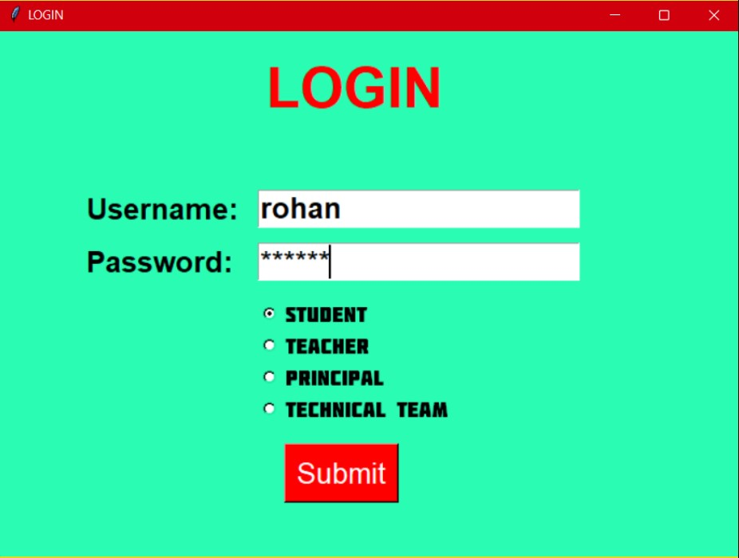
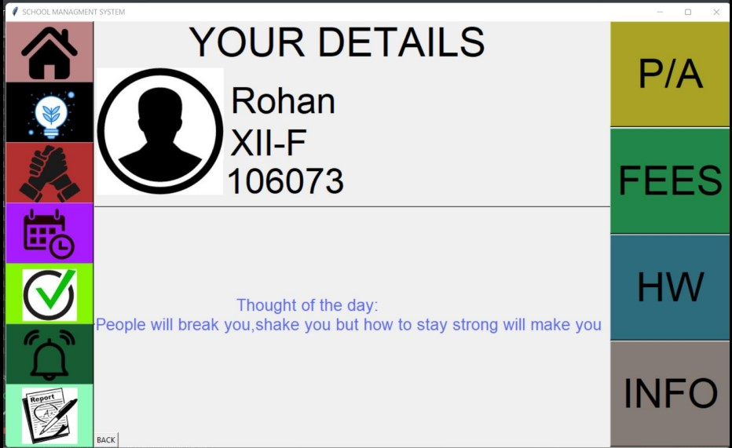
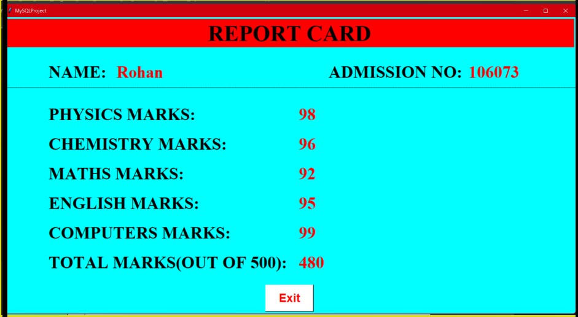

# SCHOOL MANAGEMENT SYSTEM

This project is a School Management System developed by Jasjeev Singh. It is built using Python and Tkinter library for GUI. The system allows you to store, access, delete, update, and create data using MySQL database.

## Getting Started

To get started with the project, follow the steps below:

1. Run `Test.py` to create the database and set up initial logins.
2. Once the database is set up, you can freely run the project.

## Screenshots

Here are some screenshots of various pages in the School Management System:

*Figure 1: Login Page*

*Figure 2: Dashboard*

*Figure 3: Student Details*

*Figure 4: Details*

## Contributing

Contributions are welcome! If you have any suggestions or improvements, feel free to submit a pull request.

## License

This project is licensed under the MIT License. See the [LICENSE](LICENSE) file for more details.